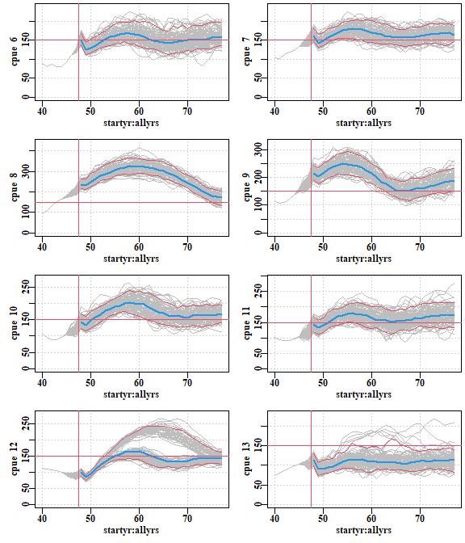

<!-- README.md is generated from README.Rmd. Please edit that file -->

# aMSE

<!-- badges: start -->

<!-- badges: end -->

This packages up a new Abalone Management Strategy Evaluation framework.
It has a novel structure that is based around the spatial ideas of
populations within spatial management units (SAUs), within a zone:

  - zone - highest geogrpahical level. Is simply the totality of the
    spatial management units.

  - SAU - spatial assessment units. In Tasmania these would currently be
    the classical statistical blocks.

  - population - literally a population. These are the active components
    within the simulation framework. The dynamics of the simulation are
    based around the populations, although, with positive larval
    dispersal (the default) there is some dependency of neighbouring
    populations on each other.

This conceptual structure has implications for how the simulations are
conditioned during the management strategy testing. While it is still
the case that the general properties of each SAU are used to set the
scene for each SAU’s component populations, the advent of sufficient GPS
logger data now allows a more formal definition of the productivity of
each population. Currently, the modelling assumes that each population
is linearly arranged around the coastline, and this will allow, where
available, specific catch/yield data to be used to define the bounds of
each population within an SAU.

An important change from previous designs is that larval dispersal is
implemented explicitly rather than implicitly being held constant. This
alters the dynamics so that analytical equilibrium methods no longer
work and we need to resort to iterative approaches to equilibrium if the
larval dispersal rate is \> 0.0.

Of course, adding such a component increases the number of options that
may need to be explored, but currently we envisage including a very low,
a middle range, and a relatively high level of larval dispersal, to
examine its implications.

## Installation

Once the MSE framework is made public you can install the development
version from [GitHub](https://github.com/haddonm/aMSE) with:

``` r
if (!require(devtools)){install.packages("devtools")} 

devtools::install_github("https://github.com/haddonm/aMSE",build_vignettes = TRUE)
```

Alternatively, while the development version remains private, you can
generate a branch that you can work on by cloning the repository, which,
again, can be done very simply within RStudio. Open the New Project
option in the project dialog at the top right of the RStudio screen and
selection Version Control, then use ‘<https://github.com/haddonm/aMSE>’
in the top box, identify where you want the new directory put, and press
return. ALternatively, you could download the zip file from inside the
‘code’ button and establish an R project from that.

It would be a good idea to read Hadley Wickham’s draft chapter on Git
and GitHub at <https://r-pkgs.org/index.html>.

## Example

This is an example which illustrates the generation of an initial
equilibrium, which then goes on to apply an early version of the
Tasmania MCDA using only 100 replicates (that bit takes about 15 seconds
on my computer, hence 2.5 minutes for 1000). It uses built in data-sets
but usually you would read in a control file, which would contain the
name of the biological datafile describing each population.

``` r
# a constant TAC example
starttime <- (Sys.time())
library(aMSE)
library(rutilsMH)
library(makehtml)
library(knitr)
# Obviously you should modify the rundir to suit your own computer
if (dir.exists("c:/Users/User/DropBox")) {
  ddir <- "c:/Users/User/DropBox/A_code/"
} else {
  ddir <- "c:/Users/Malcolm/DropBox/A_code/"
}
rundir <- paste0(ddir,"aMSEUse/conddata/generic")  # data and results directory
dirExists(rundir,make=TRUE,verbose=TRUE)
#> c:/Users/Malcolm/DropBox/A_code/aMSEUse/conddata/generic :  exists
# equilibrium zone -------------------------------------------------------------
# You now need to ensure that there is, at least, a control.csv, and a 
# constantsdata.csv file in the data directory plus some other data .csv files
# depending on how conditioned you want the model to be. Templates for the
# correct format can be produced using ctrlfiletemplate(), datafiletemplate().
# 
# Of course, usually one would use data files, control.csv and a zone.csv, which
# is listed as the datafile within the control.csv. These must be stored in 
# rundir. There are example control and data files in the DropBox folder:
# C:\Users\User\Dropbox\National abalone MSE\aMSE_files. Copy the control2.csv
# and zonewest.csv into you rundir. Then, assuming yo have the very latest
# version of aMSE = 5300, the following code should work. Recently both aMSE and
# makehtml have been altered so that all references to resdir have been changed
# to rundir, so both packages will need updating. See their respective GitHub
# readme pages for details.

# TasmanianHS.R should be in rundir, but during development is in data-raw
source(paste0(ddir,"aMSE/data-raw/","TasmanianHS.R"))
# generate equilibrium zone ----------------------------------------------------
starttime2 <- (Sys.time())
zone <- makeequilzone(rundir,"control2.csv",cleanslate = TRUE) # normally would read in a file
#> All required files appear to be present 
#> Files read, now making zone 
#> matureB Stable 
#> exploitB Stable 
#> recruitment Stable 
#> spawning depletion Stable
equiltime <- (Sys.time()); print(equiltime - starttime2)
#> Time difference of 15.80114 secs
# declare main objects ---------------------------------------------------------
glb <- zone$glb
ctrl <- zone$ctrl
zone1 <- zone$zone1
projC <- zone1$projC
condC <- zone1$condC
zoneC <- zone$zoneC
zoneD <- zone$zoneD
product <- zone$product
# add some tables and plots into rundir
biology_plots(rundir, glb, zoneC)
plotproductivity(rundir,product,glb)
numbersatsize(rundir, glb, zoneD)
# Condition on Fishery ---------------------------------------------------------
zoneDD <- dohistoricC(zoneD,zoneC,glob=glb,condC,sigR=1e-08,sigB=1e-08)
# save conditioned results -----------------------------------------------------
save(zoneDD,file=filenametopath(rundir,"zoneDD.RData"))
# Illustrate productivity
propD <- getzoneprops(zoneC,zoneDD,glb,year=47)
addtable(round(t(propD),4),"propertyDD.csv",rundir,category="zoneDD",caption=
           "Properties of zoneD after conditioning on historical catches.")
addtable(round(t(zoneDD$harvestR[45:47,]),4),"final_harvestR.csv",rundir,
         category="zoneDD",caption="Last three years of harvest rate.")
popdefs <- getlistvar(zone$zoneC,"popdef")
addtable(round(t(popdefs),3),"popdefs.csv",rundir,category="zoneDD",caption=
           "Population specific definitions")
# Prepare projections ----------------------------------------------------------
cmcda <- mcdahcr(arrce=condC$histCE,hsargs=hsargs,
                 yearnames=rownames(condC$histCE),saunames=glb$saunames)
pms <- cmcda$pms
multTAC <- cmcda$multTAC
#out <- prepareprojection(projC,zoneC,glb,zoneDD,ctrl,multTAC)
out <- prepareprojectionnew(projC=projC,condC=condC,zoneC=zoneC,glb=glb,
                            zoneDD=zoneDD,ctrl=ctrl,varyrs=8,
                            multTAC=multTAC,lastsigR = 0.25)

zoneDP <- out$zoneDP
projC <- out$projC
zoneCP <- out$zoneCP
zoneDDR <- out$zoneDDR

zoneDP <- doTASprojections(ctrl,zoneDP,zoneCP,condC$histCE,glb,mcdahcr,hsargs)
# save more plots to rundir ----------------------------------------------------
out <- plotbysau(zoneDP,glb,rundir)

projtime <- Sys.time()
print(projtime - starttime)
#> Time difference of 1.0881 mins

# make results webpage ---------------------------------------------------------
replist <- list(starttime=as.character(starttime),endtime=as.character(projtime))

# Unhash the make_html command to generate the results webspage
# make_html(
#   replist = replist,
#   rundir = rundir,
#   width = 500,
#   openfile = TRUE,
#   runnotes = NULL,
#   verbose = FALSE,
#   packagename = "aMSE",
#   htmlname = "aMSE"
# )
```

After running the whole, even if you do not generate the results
webpage, you could also try:

``` r
B0 <- getvar(zoneC,"B0")
ExB0 <- getvar(zoneC,"ExB0")

zoneDsau <- zonetosau(zoneDDR,glb,B0,ExB0)
zonePsau <- zonetosau(zoneDP,glb,B0,ExB0)

nsau <- glb$nSAU
label <- glb$saunames
CIprobs <- c(0.05,0.5,0.95)
sauCI <- vector("list",nsau)
postyrs <- ctrl$projection
startyr <- 40

invar <- "cpue"
prerep <- zoneDsau[[invar]]
allrep <- zonePsau[[invar]]
preyrs <- dim(prerep)[1]
allyrs <- preyrs + postyrs
reps <- dim(prerep)[3]

plotprep(width=8, height=8,newdev=FALSE)
parset(plots=c(4,2))
for (sau in 1:nsau) {
  ymax <- getmax(rbind(prerep[startyr:preyrs,sau,],allrep[,sau,]))
  traj <- c(prerep[startyr:preyrs,sau,1],allrep[,sau,1])
  plot(startyr:allyrs,traj,type="l",lwd=1,col="grey",panel.first=grid(),
       ylab=paste0(invar,"  ",label[sau]),ylim=c(0,ymax))
  for (i in 2:reps)
    lines(startyr:allyrs,c(prerep[startyr:preyrs,sau,i],allrep[,sau,i]),lwd=1,col="grey")
  CI <- apply(allrep[,sau,],1,quantile,probs=CIprobs)
  lines((preyrs+1):allyrs,CI[2,],lwd=2,col=4)
  lines((preyrs+1):allyrs,CI[1,],lwd=1,col=2)
  lines((preyrs+1):allyrs,CI[3,],lwd=1,col=2)
  sauCI[[sau]] <- CI
  abline(v=(preyrs+0.5),col=2)
 if (invar == "cpue") abline(h=150,col=2)
}
```



See the vignette Running\_aMSE.Rmd for a more detailed example.

See the New.Rd for recent developments
